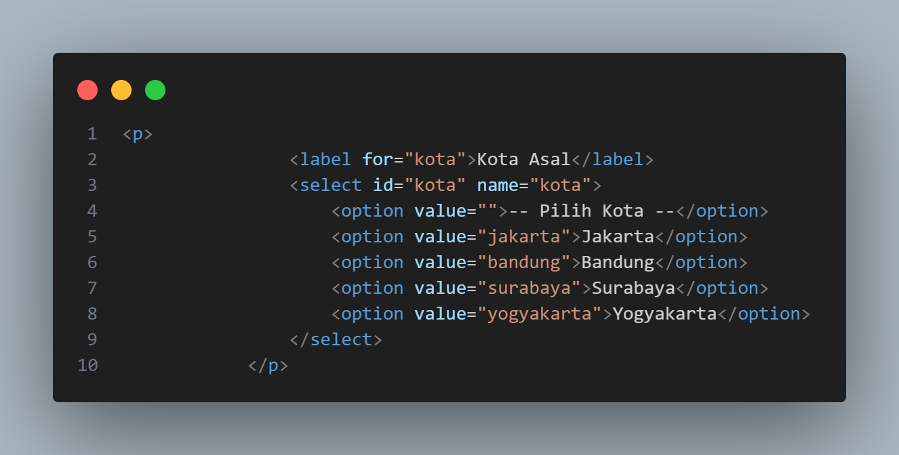
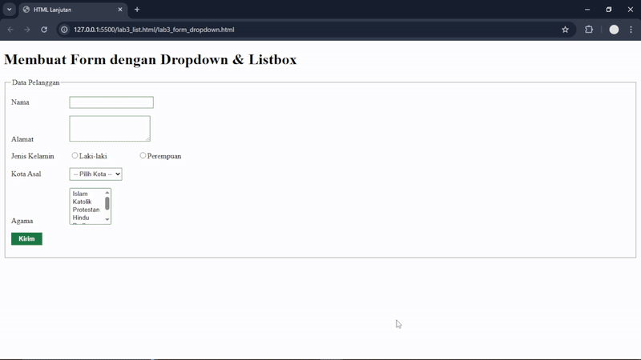
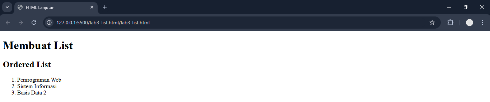
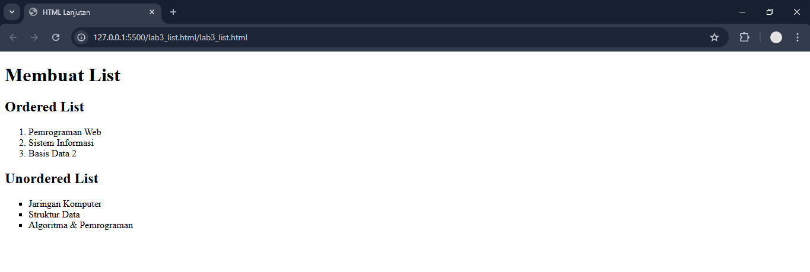
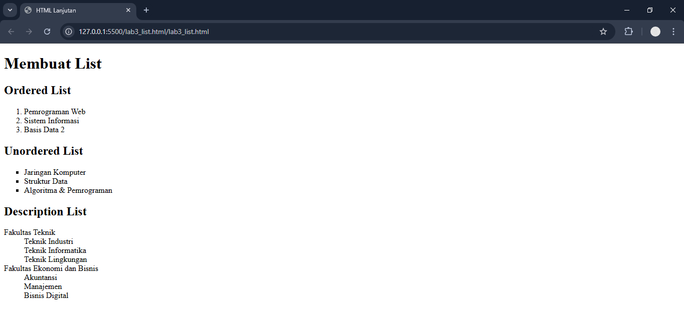
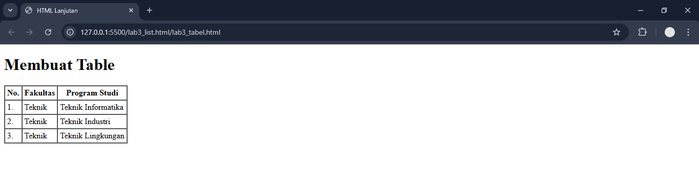
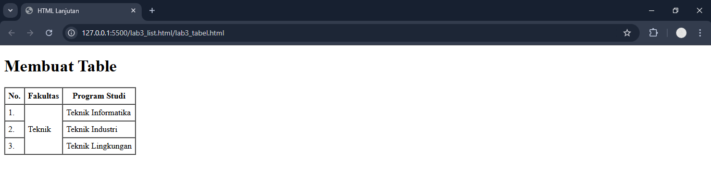
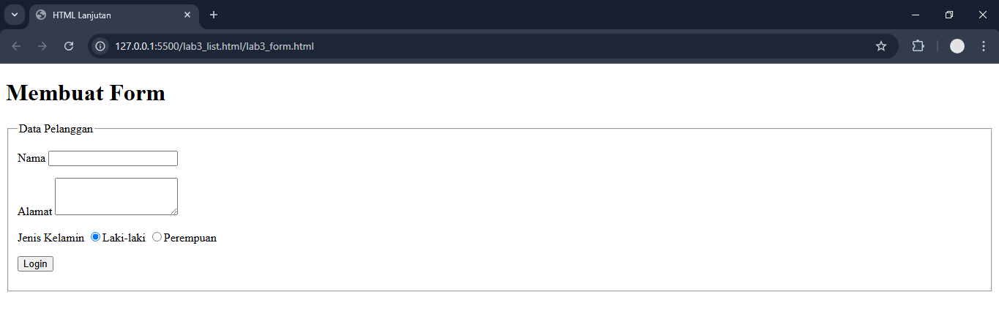
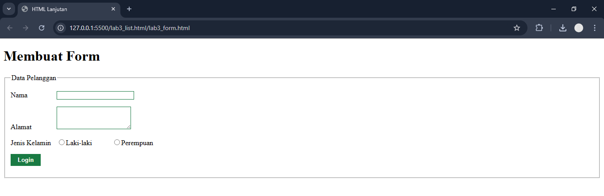

# Tugas Matakuliah Pemrograman Web Pertemuan 4

## Menampilkan Dropdown Menu dan Listbox dengan Multiple Selection pada Form.
### Menampilkan Dropdown Menu

`<select>` digunakan untuk membuat elemen dropdown menu, yaitu menu pilihan yang hanya menampilkan satu pilihan pada satu waktu.
`id="kota"` dan `name="kota"` digunakan untuk menghubungkan label dengan elemen dan mengirimkan data ke proses.php saat form dikirim.
`<option>` setiap baris `<option>` mewakili satu pilihan dalam dropdown.

### Membuat Listbox Multiple Selectiom

Masih menggunakan tag `<select>`, tetapi ditambahkan atribut `multiple` dan `size="4"`.
`multiple` memungkinkan pengguna memilih lebih dari satu pilihan (menggunakan tombol Ctrl di Windows atau Cmd di Mac).
`size="4"` menampilkan 4 baris pilihan sekaligus tanpa harus membuka dropdown (jadi tampil seperti listbox).
`name="agama"` digunakan untuk mengirimkan semua pilihan yang dipilih.
Jika kamu ingin mengirim beberapa nilai sekaligus sebagai array, kamu bisa menulis `name="agama[]"`.
`<option>` → setiap opsi adalah pilihan agama yang bisa dipilih pengguna.

Dan hasilnya akan seperti ini

# Praktikum 3

## A. Membuat List
###  1. Membuat Ordered List

###  2. Membuat Unordered List

###  3. Membuat Description List

## B. Membuat Table
###  1. Membuat Table

###  2. Menggabungkan Sel Data

## C. Membuat Form
###  1. Membuat Form

###  2. Menambahkan Style pada Form

